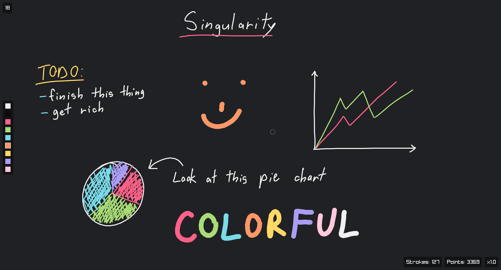

<h1 align="center">⚠️ WIP ⚠</h1>

# Singularity

Simple whiteboard app with an infinite canvas

# Install

_Binary distributions comming soon_

**Linux**

Run `build.sh` from the root folder

**Windows**

Run `build.bat` from the root folder

# Keybindings

- `Mouse wheel` : Zoom in / out
- `r` : Reset zoom
- `=` : Increase brush size
- `-` : Decrease brush size
- `0` : Reset brush size
- `Middle mouse` : Pan
- `w/s/a/d` : Pan up / down / left / right
- `Ctrl + z` : Undo
- ~~`Ctrl + y` : Redo~~
- `0-9` : Select color
- `Tab` : Hide / Show UI

# Configuration

No configuration file yet. For now you have to modify the macros starting with `_` and recompile.

# Dependencies

- [Raylib](https://www.raylib.com/index.html) (included)
- [Cmake](https://cmake.org/)
- [Git](https://git-scm.com/)
